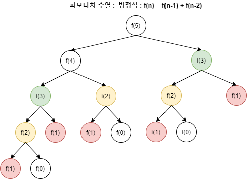

# Dynamic Programming

- 한 번 계산한 문제는 다시 계산하지 않도록 하는 알고리즘

### 중복되는 연산을 줄이자.
- 최적의 해를 구하기에 시간과 메모리 공간이 매우 많이 필요한 문제 등은 컴퓨터로도 해결하기 어렵습니다.
- 그래서 우리는 연산 속도와 메모리 공간을 최대한으로 활용할 수 있는 효율적인 알고리즘을 작성해야 합니다.
- 그 중에서 **메모리 공간을 조금 더 사용하고 연산 속도를 비약적으로 높이는 방법**이 있는데 그 중 대표적인 방법이 **다이나믹 프로그래밍**(Dynamic Programming) 기법으로 동적 계획법 이라고 표현하기도 합니다.

<br>

- 다이나믹 프로그래밍을 적용할 수 있는 가장 대표적인 예제는 피보나치 수열의 연산입니다.
- 피보나치 수열은 n-2항과 n-1항을 더해 n 항이 되는 수열입니다.
- 그렇기 때문에 n항을 구하기 위해서는 n-1, n-2, n-3 ... 항을 모두 계산해주어야 연산이 가능합니다.
- 보통의 풀이인 **재귀함수**로 풀었을 경우에는 다음과 같은 현상이 발생합니다.
    - 하나의 n번째 값을 알고 싶다면 같은 값을 여러번 호출하게 됩니다.
    - 아래 그림처럼 fibonacci(5)라면 f(0)은 3번, f(1)은 5번, f(2)는 번 연산해주어야 합니다.
    - 즉 동일한 함수가 반복적으로 호출되어야 합니다. 이미 계산된 값이지만, 계속 호출할 때마다 계산을 새롭게 하게 됩니다.
    - 이러한 문제 때문에 빅오 표기법으로 O(2^N) 의 시간복잡도가 소요됩니다.
    - 이는 N=30 이면 약 10억 가량의 연산을 수행해야 합니다.

- n 번째 항을 연산하기 위해서 그 이하의 항이 반복적으로 호출됩니다.


```python
## 재귀함수로 피보나치 수열
def fibo(x):
    if x == 1 or x == 2:
        return 1
    return fibo(x-1)+fibo(x-2)

print(fibo(6)) # 8
```
<br>

- 피보나치를 재귀함수로 풀 수 있지만, 단순히 매번 계산하도록 하면 문제를 효율적으로 해결할 수 없습니다. 이러한 문제는 다이나믹 프로그래밍을 사용하면 쉽게 해결할 수 있습니다.
- 모든 경우에 다이나믹 프로그래밍을 적용할 수 있는 조건
    1. 큰 문제를 작은 문제로 나눌 수 있다.
    2. 작은 문제에서 구한 정답은 그것을 포함하는 큰 문제에서도 동일합니다.

- 피보나치 수열을 다이나믹 프로그래밍 중 `메모이제이션`기법을 사용해서 해결해봅시다.
- 이 방식을 적용했을 때는 이미 계산한 값을 가져와 더하기만 하면 되기 때문에 시간복잡도는 O(N)이 됩니다.

```python
## 다이나믹 프로그래밍 - 메모이제이션 Memoization
## 탑다운 방식
d = [0] * 100 ## 미리 계산 값을 저장할 리스트를 선언

def fibo(x):
    if x == 1 or x == 2:
        return 1
    
    if d[x] != 0:
        return d[x]
    
    d[x] = fibo(x-1) + fibo(x-2)
    return d[x]

print(fibo(99)) # 218922995834555169026
```
<br>

- DP 에는 탑다운(메모이제이션) 방식과 바텀업 방식이 있습니다.
    - 탑다운 방식
        - 미리 계산해놓는 것이 아니라 필요할 때마다 계산해서 어딘가에 저장해두는 방법
        - 위의 메모이제이션 방법은 탑다운 방법입니다.
        - 메모리를 많이 소모한다.
        - 재귀적인 호출로 재귀 depth 에러가 발생할 수 있습니다.
    - 바텀업 방식
        - 미리 모든 범위를 계산해 놓은 뒤 가져다 쓰는 방법입니다.
        - 메모리 효율이 좋습니다. 대게 이 방법을 추천합니다.

- DP 문제에서는 메모리에 제한이 있을 수 있으므로
```python
## 바텀업 방식
d = [0]*100
d[1] = 1
d[2] = 1
n = 99

for i in range(3, n+1):
    d[i] = d[i-1] + d[i-2]

print(d[99]) # 218922995834555169026
```
<br>

### 분할적복 vs 다이나믹프로그래밍 ????????????
- 어떤 차이가 있는지 이해가 안됨. 213p

### 동적할당과 다이나믹 프로그래밍
- `다이나믹` 이라는 것은 `프로그램이 실행하는 도중에` 라는 의미를 가지고 있습니다.
- 그렇기 때문에 프로그램 실행 중 프로그램 실행에 필요한 메모리를 할당하는 기법인 동적할당(Dynamic Allocation)과 다이나믹 프로그래밍의 `Dynamic`은 같은 의미가 아닙니다.
<br>


## 문제: 1로 만들기
- p.219
- 정수 X가 주어질 때 X에 사용할 수 있는 연산은 다음과 같이 4가지
    1. X가 5로 나누어 떨어지면 5로 나눈다.
    2. X가 3로 나누어 떨어지면 3로 나눈다.
    3. X가 2로 나누어 떨어지면 2로 나눈다.
    4. X가 1을 뺀다.
- 정수 X가 주어졌을 대 연산 4개를 적절히 사용해서 1을 만들려고 할때 연산을 사용하는 횟수의 최솟값을 출력하시오.

```python
## 안보고 다시 풀어보기!
x = 26
d = [0] * 30001

for i in range(2, x + 1):
    ## -1 연산하는경우로 먼저 가정해서 값을 넣음
    d[i] = d[i-1] + 1
    
    ## 2, 3, 5 로 나누어지는 경우 계산이 달라지므로..
    if i%2 == 0:
        d[i] = min(d[i], d[i//2] + 1)
    if i%3 == 0:
        d[i] = min(d[i], d[i//3] + 1)
    if i%5 == 0:
        d[i] = min(d[i], d[i//5] + 1)
    
print(d[:27])
# [0, 0, 1, 1, 2, 1, 2, 3, 3, 2, 2, 3, 3, 4, 4, 2, 3, 4, 3, 4, 3, 4, 4, 5, 4, 2, 3]

```

## 문제: 개미 전사
- p.220
- 일직선상에 있는 메뚜기 식량창고를 공격해 식량을 약탈 할 것입니다.
- 인접한 창고를 공격하면 메뚜기 정찰병에게 탄로납니다.
- 메뚜기 정찰병에게 들키지 않고 최대한 많은 식량을 탈취했을 때 최대값을 구하세용

```python
## 안보고 다시풀어보기
n = 4 
container = [1, 3, 1, 5]

d[0]*(n+1)

d[0] = container[0]
d[1] = max(container[1], container[0])

for i in range(2, n):
    d[i] = max(d[i-1], d[i-2] + container[i])

print(d[n-1]) # 8
```
<br>

- 내 해석
    - 처음엔 짝/홀로 다 더하면 되지 않나 했는데, 그러면 [100, 1, 1, 200, 1] 일경우 201 일 최대가 되지만, 사실 300을 가져올 수 있기 때문에 이 방법은 틀렸습니다.
    - 풀이를 본 후 생각한 것은 d[0] 이면 0번째를 선택했을 때 얻을 수 있는 이득을 저장, d[1]을 선택했을 때 는 d[0]을 선택할 수 없으므로 둘중 큰 값을 저장, d[2] 부터는 `for`문으로 계산하여 0~i번까지 선택을 했을 때 최대로 얻는 방법은 d[i-1] 번과  d[i-2] + container[i] 중 큰 값인 것입니다.

<br>


## 문제: 바닥 공사

- 타일 설치 문제
- 가로 길이가 N 세로길이가 2인 직사각형(2xN) 형태의 얇은 바닥에 1x2, 2x1, 2x2 크기의 타일로 채우는 모든 경우의 수를 구하는 문제.
- 1 <= N <= 1000

- 바닥을 채우는 방법의 수를 796,796으로 나눈 나머지를 출력합니다.

- DP의 단골 유형인 타일링 문제 유형
    - 문제를 분석할 때 i번째 위치에 이전 경우의 수들과의 관계를 생각해보면 됩니다.
    - 마지막에 오는 타일이 2x1 인 경우 i-1 번째 경우의 수와 같습니다. 
    - 마지막에 오는 타일이 2x2 혹은 1x2 2개인 경우, i-2까지의 경우의 수 이후에 올 수 있는 타일이 2가지 방법(2x2 혹은 1x2 2개)이므로 i-2 번째 항의 2배의 경우의 수를 가집니다.
    - 이 두 경우를 더하면 되므로 점화식은 `a[i] = a[i-1] + a[i-2]*2` 가 됩니다.

```python
### 다시풀어보기!
## 점화식을 세웠음. a[i] = a[i-1] + a[i-2] *2
n = 3

d2 = [0]*1001
d2[1] = 1
d2[2] = 3

for i in range(3, n+1):
    d2[i] = (d2[i-1] + d2[i-2]*2)%796796 ## 숫자가 너무커서 이 나머지로 출력

print(d[n])
print(d[:n])
```
<br>


## 문제: 효율적인 화폐 구성

- N가지 종류의 화폐를 이용해 목적으로 하는 금액을 만들 때, 최소한의 개수로 화폐를 사용할 때 사용된 화폐의 개수를 구하는 문제.

- 1 <= N <= 100, 1 <= M <= 10000
- N 개의 화폐 종류, M은 목적금액
- 만들기가 불가능 할 경우에는 -1을 리턴합니다.

```python
## 다시 풀어보기
n, m = 2, 15
coin = [2, 3]

d = [m+1]*(m+1) ## 처음에는 불가능한 값으로 모든 값을 세팅.(불가능하다는 판단 하기 위해서)
d[0] = 0

for c in coin:
    for i in range(c, m+1):
        if d[i-c] != (m+1):
            d[i] = min(d[i], d[i-c]+1)

if d[m] == m+1:
    print(-1)
else:
    print(d[m])

print(d)
```